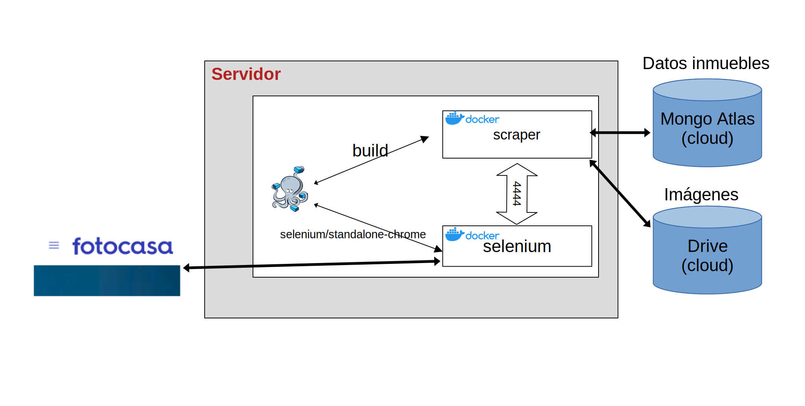

# Rent prices

## Descripción 🚀

Repositorio realizado para la práctica 1 de web scraping de la asignatura _Tipología y ciclo de vida de los datos_ del Máster en Ciencia de Datos de la [Universitat Oberta de Catalunya](https://www.uoc.edu/portal/en/index.html).

El proyecto aquí presente busca trabajar con diversas páginas web de venta y alquiler de alojamientos para descargar los datos presentes. Concretamente se ha trabajado exclusivamente con el alquiler, centrándonos en los hechos acarreados los últimos años en los que se ha visto un incremento de la demanda y por consecuencia de sus precios. La web seleccionada para la obtención de los datos se trata de  [Fotocasa](https://www.fotocasa.es/es/), pero la generación del código ha sido enfocada para que se pueda ampliar y desarrollar otras clases que trabajen con otras plataformas de similares contextos.

A lo largo de este _README_ se puede observar el contenido concreto del repositorio, pero para una mayor descripción del conjunto de datos es posible acceder al informe situado en la carpeta _**pdf**_.

### Metodología de desarrollo

A lo largo del desarrollo de la aplicación se ha aplicado una metodología Scrum, con reuniones semanales en las que se establecen las tareas finalizadas, los problemas/errores obtenidos y la definición de los siguientes pasos a realizar. El correspondiente tablero se puede encontrar en el siguiente [enlace](https://github.com/jvruoc/rent_prices/projects/1).

### Estado actual del proyecto

A lo largo del proyecto se han solventado diversas tareas las cuales están reflejadas en el [tablero de trabajo de este proyecto](https://github.com/jvruoc/rent_prices/projects/1). Pero dentro de estas podemos destacar algunas más concretas como:

* Gestión del user-agent
* Pruebas con diversos proxies (en desarrollo)
* Gestión de sesiones (en desarrollo)
* Dockerizar la aplicación
* Gestión de elementos dinámicos de la aplicación para obtener los datos
* …

Después de todo el desarrollo aplicado podemos ver el resultado que obtenemos hasta el momento (elemento de ejemplo obtenido con el programa):

```json
{
    "download-date": "29/03/2022",
    "Source": "Fotocasa",
    "title": "Piso de alquiler en ...",
    "link": "https: //www.fotocasa.es/es/alquiler/vivienda/madrid-capital/aire-acondicionado-calefaccion-ascensor-amueblado-television-internet/162096792/d",
    "precio": "6.550 € /mes",
    "periodicidad": "/mes",
    "feaures": [],
    "Antigüedad": "+ 100 años",
    "Orientación": "Sur",
    "Mascotas": "",
    "Tipo de inmueble": "Piso",
    "Agua caliente": "Gas Natural",
    "Calefacción": "Gas Natural",
    "Estado": "Casi nuevo",
    "Planta": "1ª planta",
    "Ascensor": "Sí",
    "Amueblado": "Sí",
    "Gastos de comunidad": "Sí",
    "Consumo energía": "D107 kW h m² / año",
    "Emisiones": "D23 kg CO₂ m² / año",
    "Address": "...",
    "extras": "Aire acondicionado, Armarios, Gres ...",
    "Contact": "ALFEREZ REAL ESTATE",
    "Ref": "AC-MA-0158",
    "RefFotocasa": "AC-MA-0158"
}
```


## Objetivo del proyecto 🚀


Se recogerá la información de la web de Fotocasa, extrayendo los datos de los apartamentos que se encuentran en alquiler. Los datos de estos apartamentos se incluirán en una BBDD de MongoDB y las imágenes publicadas para cada anuncio se descargarán en una unidad de Google Drive.

El proceso se ejecutará diariamente para poder obtener la evolución de los precios de alquiler de un inmueble e intentar determinar el tiempo que está publicado cada uno de los anuncios. 




La aplicación está preparada para su ejecución en docker a través del `webdriver remote` de selenium.

Se crea un contenedor que contiene la applicación construida (`scraper`), que accede a otro contenedor con Selenium instalado (`selenium/standalone-chrome:3.141`).

El contenedor de Selenium incluye todos los componentes necesarios para el acceso a páginas web sin necesidad de instalar ningún navegador en el servidor, y al utilizarlo de forma conjunta con el contenedor de la aplicación, se puede ejecutar de forma sencilla en cualquier dipositivo.


## Contenido 📦

El proyecto se distribuye con el siguiente árbol de directorios:

```
rent_prices/
├── docker-compose.yml    --> Configuración selenium y scraper
├── Dockerfile            --> Imagen scraper
├── logfile.log           --> Fichero de log
├── pdf
│   ├── images
│   └── README.md
├── README.md
├── src
│   ├── rent_prices
│   │   ├── __init__.py
│   │   ├── logger
│   │   │   ├── __init__.py
│   │   │   ├── logger.py           --> logger de la app
│   │   │   ├── logging_config.ini  --> Configuración logger
│   │   │   └── __pycache__
│   │   ├── scrapers
│   │   │   ├── __init__.py
│   │   │   ├── __pycache__
│   │   │   ├── scraperMock.py      --> Ejemplo scraper
│   │   │   └── scraper.py          --> Clase base
│   │   │   └── scraperFotocasa.py  --> Clase heredada Fotocasa
│   │   │   └── scraperIdealista.py --> Clase heredada Idealista   
│   │   └── utilities
│   │       ├── __init__.py
│   │       ├── proxyManager.py     --> Pruebas proxies rotatorios
│   │       └── __pycache__
│   └── requirements.txt    --> Dependencias python
└── tests
    └── __init__.py

```

### Instalación 🔧

#### Local

El proyecto tiene un entorno virtual, para crear el entorno y activarlo:
```
python -m venv .venv/
source .venv/bin/activate
pip install -r requirements.txt
```

_Es importante para el correcto despliegue que el fichero `requirements.txt` tenga todas las dependencias bien definidas._

Para añadir nuevas dependencias:
```
python -m venv .venv/
source .venv/bin/activate
pip install <nueva libreria>
pip freeze > requirements.txt
```

#### Docker

Para ejecutar la aplicación en Docker:

```
docker-compose up --build --abort-on-container-exit
```

Esta instrucción reconstruye el docker e inicia el servicio de Selenium y del Scraper para iniciar la extracción de información. El parámetro `--abort-on-container-exit` hace que cuando un contenedor se detiene se pare el resto de contenedores, así cuando el Scraper finaliza de extraer la información se para también el contenedor de selenium.

El objetivo de llevar el desarrollo a contenedores es poder desplegarlo en un servidor de forma sencilla. Una vez que se finalice la programación de la aplicación, se puede construir una imagen y crear un contenedor a partir de la imagen.

Independientemente de las aplicaciones instaladas en el servidor, cuando se inicien los servicios será capaz de realizar el scraping.

La planificación de su ejecución en el servidor se puede hacer con airflow si se incluye en el contenedor o con crontab si no queremos incluir muchos componentes en el proyecto.

### Código

He creado una clase base, _Scraper.py_, que tiene el código para conectarse a Selenium en local o en remoto, si ejecutamos en local utiliza el DriverManager, en remoto utiliza la instalación de Selenium pero en remoto.

* En local: pruebas en nuestros equipos
* En remoto (docker): despligue en servidor

A parte de estas conexiones para conectarse a Selenium, dicha clase define los métodos establecidos para acceder a los datos de la web e iterar en las diversas páginas devolviendo los elementos con todas sus características. Algunos de estos métodos son abstractos para garantizar que pueda servir en diferentes webs. Como se puede ver en la clase _ScraperFotocasa.py_ estos métodos heredados de la clase padre se centran en funcionalidades específicas de la web como _aceptar las cookies_, _seleccionar la siguiente página_ ó _obtener contenido específico_.

## Autores ✒️

* [Jose Ventura Roda](https://www.linkedin.com/in/joseventuraroda/)
* [Kevin Martín Chinea](https://www.linkedin.com/in/kevmch/)

## Recursos 📄


## Sobre proxies rotatorios

He probado los proxies de "http://free-proxy-list.net" y en la primera prueba me ha indicado que funcionaba sólo 1 de la lista, pero al probar por segunda vez ya me ha indicado que no funcionaba ninguno.
